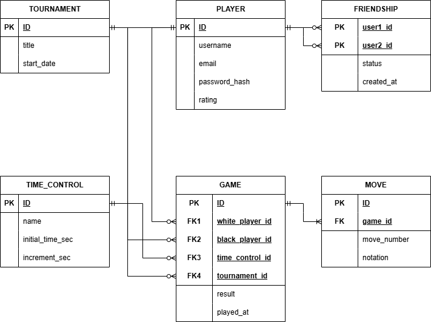

# Документація до лабораторної (README)

## Зміст

1. Короткий виклад вимог
    
2. Діаграма ER
    
3. Сутності, їх атрибути та зв'язки
    
4. Припущення та обмеження
    

---

## Короткий виклад вимог

**Потреби зацікавлених сторін:** Користувачам необхідна зручна платформа для гри в шахи (як PvP з іншими людьми, так і PvE проти ШІ Stockfish), яка зберігає історію всіх зіграних партій для подальшого аналізу. Система повинна підтримувати різні формати контролю часу, дозволяти об'єднувати партії в турніри, вести підрахунок рейтингу (Elo) та надавати можливість гравцям додавати один одного в друзі.

**Дані для зберігання:** Облікові записи гравців (з поточною статистикою та рейтингом), глобальні налаштування режимів контролю часу (рапід, бліц тощо), дані про турніри, детальні метадані кожної шахової партії (результат, час, учасники), покрокова історія ходів у форматі нотації, а також соціальні зв'язки (список друзів із зазначенням статусу запиту).

**Бізнес-правила:** Жодна партія не може бути створена без участі хоча б одного зареєстрованого гравця. Рейтинг гравця оновлюється після кожної рейтингової партії і не може падати нижче базового мінімуму. Кожен хід повинен бути строго прив'язаний до існуючої партії та мати правильний порядковий номер. Запити на додавання в друзі не можуть дублюватися між двома однаковими користувачами.

---

## Діаграма ER

Концептуальна модель (рівень логічного проєктування), яка деталізує архітектуру даних системи, виконана в нотації «вороняча лапка» (Crow's foot).

 
 

---

## Сутності, їх атрибути та зв'язки

### Список сутностей та атрибутів:

- **Player (Гравець):** Ядро системи. Атрибути: `id` (PK), `username` (унікальне ім'я), `email` (унікальна пошта), `password_hash` (зашифрований пароль), `rating` (поточний рейтинг Elo).
    
- **Time_Control (Контроль часу):** `id` (PK), `name` (назва режиму, наприклад, "Бліц 5+3"), `initial_time_sec` (початковий час у секундах), `increment_sec` (додавання секунд за хід).
    
- **Tournament (Турнір):** `id` (PK), `title` (назва турніру), `start_date` (дата та час початку).
    
- **Game (Партія):** `id` (PK), `white_player_id` (FK), `black_player_id` (FK), `time_control_id` (FK), `tournament_id` (FK, nullable), `result` (результат гри), `played_at` (дата проведення).
    
- **Move (Хід):** `id` (PK), `game_id` (FK), `move_number` (номер ходу), `notation` (запис ходу, наприклад, "e4" або "Nf3").
    
- **Friendship (Друзі):** `user1_id` (PK, FK), `user2_id` (PK, FK), `status` (статус дружби), `created_at` (дата створення запиту).
    

### Пояснення зв'язків прозою:

- **Player — Game (Один до багатьох):** Один гравець може зіграти безліч партій. Цей зв'язок реалізовано двічі: окремо для гравця білими фігурами (`white_player_id`) і чорними (`black_player_id`).
    
- **Game — Move (Один до багатьох):** Партія складається з багатьох послідовних ходів, але кожен конкретний запис ходу належить виключно одній партії.
    
- **Time_Control — Game (Один до багатьох):** Конкретний режим часу (наприклад, класика) може бути застосований до тисяч різних партій.
    
- **Tournament — Game (Один до багатьох):** Турнір об'єднує в собі багато партій. При цьому партія може належати лише одному турніру, або взагалі не належати жодному (вільна гра).
    
- **Player — Friendship (Багато до багатьох):** Користувач може мати багато друзів, і сам може бути другом для багатьох. Зв'язок розв'язано через асоціативну таблицю `Friendship`.
    

---

## Припущення та обмеження

- **Гнучкість суперника (Гра проти ШІ):** Зроблено припущення, що гравець може грати проти комп'ютера. У такому випадку поле `black_player_id` (або `white_player_id`, якщо людина грає чорними) залишається `NULL`, що сигналізує бекенду про необхідність підключення рушія Stockfish як опонента.
    
- **Необов'язковість турніру:** Атрибут `tournament_id` у таблиці `Game` може бути порожнім (`NULL`), оскільки більшість партій гратимуться у звичайному режимі підбору (Matchmaking), поза межами змагань.
    
- **Обмеження на рівні словників (ENUM):** Атрибут `result` у таблиці `Game` обмежений списком значень (наприклад: `WhiteWins`, `BlackWins`, `Draw`, `InProgress`). Аналогічно, атрибут `status` у таблиці `Friendship` приймає лише визначені стани: `pending` (очікує підтвердження), `accepted` (друзі), `blocked` (заблоковано).
    
- **Унікальність дружби:** У таблиці `Friendship` використовується композитний первинний ключ (одночасно `user1_id` та `user2_id`). Це гарантує на рівні бази даних, що між двома конкретними користувачами може існувати лише один актуальний запис про їхні соціальні відносини.
    
- **Захист рейтингу:** Припускається системне обмеження в базі даних (`CHECK constraint`), згідно з яким поле `rating` у таблиці `Player` не може бути меншим за визначений мінімум (наприклад, 100 балів Elo).
    
