# Документація до Лабораторної №3 (README)

## Зміст

1. [Короткий виклад вимог](###Короткий-виклад-вимог)
    
2. [Код відповідних OLTP запитів та Результати перевірки роботи запитів](##Код-відповідних-OLTP-запитів-та-Результати-перевірки-роботи-запитів)
    
3. [Висновок до лабораторної роботи](##Висновок)
    

## Короткий-виклад-вимог

- Написати запити `SELECT` для отримання даних (включаючи фільтрацію за допомогою `WHERE` та вибір певних стовпців).
    
- Практикувати використання операторів `INSERT` для додавання нових рядків до таблиць.
    
- Практикувати використання оператора `UPDATE` для зміни існуючих рядків (використовуючи `SET` та `WHERE`).
    
- Практикувати використання операторів `DELETE` для безпечного видалення рядків (за допомогою `WHERE`).
    
- Вивчити основні операції маніпулювання даними (DML) у PostgreSQL та спостерігати за їхнім впливом.
    

## Код-відповідних-OLTP-запитів-та-Результати-перевірки-роботи-запитів
(даних було замало для виконання різних операцій, додаємо ще)

```
-- Додавання нових гравців
INSERT INTO Player (username, email, password_hash, rating) VALUES
('Stockfish_Lvl_1', 'bot1@chess-engine.local', 'bot_pass', 800),
('Stockfish_Lvl_8', 'bot8@chess-engine.local', 'bot_pass', 3200),
('Oksana_Chess', 'oksana.play@ukr.net', 'hashed_pass_4', 1950),
('Kyiv_Tactician', 'kyiv.tact@gmail.com', 'hashed_pass_5', 2100),
('NoobSlayer2026', 'slayer@example.com', 'hashed_pass_6', 1100),
('Vasyl_Master', 'vasyl.m@ukr.net', 'pass_vasyl_123', 1850);

-- Додавання популярних режимів часу
INSERT INTO Time_Control (name, initial_time_sec, increment_sec) VALUES
('Bullet 2+1', 120, 1),
('Blitz 3+2', 180, 2),
('Classical 90+30', 5400, 30);

-- Додавання нових турнірів 
INSERT INTO Tournament (title, start_date) VALUES
('Summer Online Open', '2026-06-01 10:00:00'),
('Beginners Arena', '2026-04-27 15:00:00'),
('Autumn Blitz Championship', '2026-09-10 12:00:00');

-- Створення різноманітних ігор
INSERT INTO Game (white_player_id, black_player_id, time_control_id, tournament_id, result) VALUES
-- Гра 3: Нічия у весняному кубку (Oksana vs Kyiv_Tactician)
(6, 7, 5, 1, 'Draw'), 
-- Гра 4: Новачок програє слабкому боту в турнірі для новачків (NoobSlayer vs Stockfish 1)
(8, 4, 3, 3, 'BlackWins'), 
-- Гра 5: Грандмастер тренується проти сильного бота в класику (GrandMaster vs Stockfish 8)
(3, 5, 6, NULL, 'InProgress'), 
-- Гра 6: Андрій виграє у Оксани в товариському бліці
(1, 6, 2, NULL, 'WhiteWins'),
--(складніше вставлення даних)
INSERT INTO public.game (white_player_id, black_player_id, time_control_id, tournament_id, result) 
VALUES (
    (SELECT MAX(id) FROM public.player),     
    4,                                        
    2,                                        
    (SELECT MAX(id) FROM public.tournament),  
    'InProgress'
);

-- Додавання ходів для Гри 3
INSERT INTO Move (game_id, move_number, notation) VALUES
(3, 1, 'e4'),
(3, 2, 'c5'),
(3, 3, 'Nf3'),
(3, 4, 'd6'),
(3, 5, 'd4'),
(3, 6, 'cxd4');

-- Додавання ходів для Гри 4 
INSERT INTO Move (game_id, move_number, notation) VALUES
(4, 1, 'f3'),
(4, 2, 'e5'),
(4, 3, 'g4'),
(4, 4, 'Qh4#'); -- Мат (BlackWins)

-- Розширення соціальної мережі
INSERT INTO Friendship (user1_id, user2_id, status) VALUES
(1, 6, 'accepted'), -- Андрій та Оксана друзі
(6, 7, 'accepted'), -- Оксана та Київський Тактик друзі
(8, 1, 'pending'),  -- Новачок хоче додати Андрія
(7, 8, 'blocked'); -- Тактик відхилив запит від Новачка
```
###
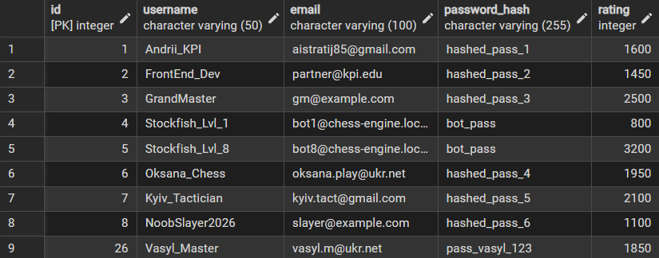
#### Рис. 1. Результат запиту для заповнення таблиці Player
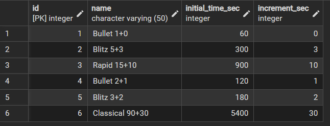
#### Рис. 2. Результат запиту для заповнення таблиці Time_Control
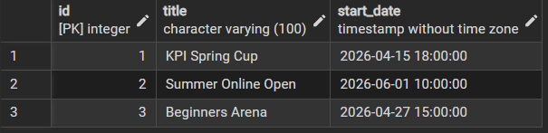
#### Рис. 3. Результат запиту для заповнення таблиці Tournament
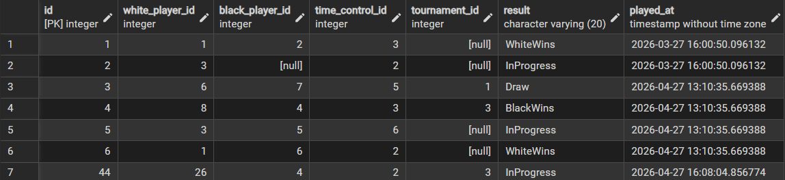
#### Рис. 4. Результат запиту для заповнення таблиці Game
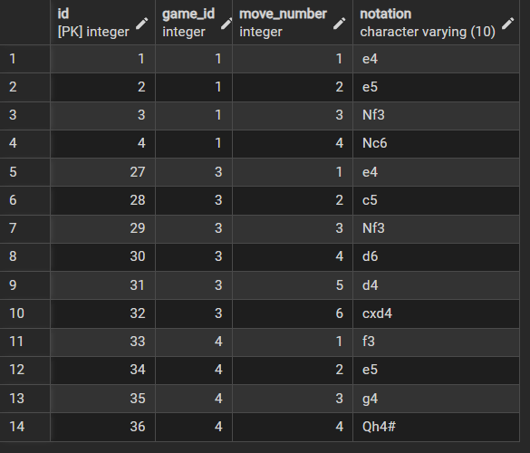
#### Рис. 5. Результат запиту для заповнення таблиці Move
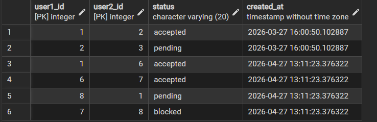
#### Рис. 6. Результат запиту для заповнення таблиці Friendship


---
##   SELECT - Отримання даних (фільтрація та вибір певних стовпців)
```

-- Вивести імена та рейтинги всіх гравців, у яких рейтинг вище 2000
SELECT username, rating 
FROM public.player 
WHERE rating > 2000;

-- Знайти всі ігри, які зараз знаходяться в процесі ('InProgress')
SELECT id, white_player_id, black_player_id, played_at 
FROM public.game 
WHERE result = 'InProgress';

-- Знайти друзів конкретного користувача (наприклад, Андрія, id=1), де запит прийнято
SELECT user2_id, created_at 
FROM public.friendship 
WHERE user1_id = 1 AND status = 'accepted';
```
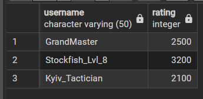
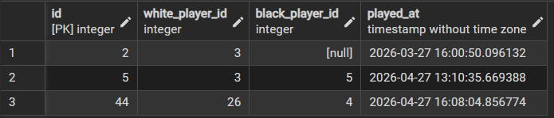

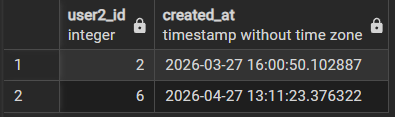

---
## UPDATE - Зміна існуючих даних
```

-- Гравець Andrii_KPI (id=1) виграв партію, оновлюємо його рейтинг (+15 пунктів)
UPDATE public.player 
SET rating = rating + 15 
WHERE id = 1;

-- Гра, яка була 'InProgress' (наприклад, id=2), завершилася внічию
UPDATE public.game 
SET result = 'Draw' 
WHERE id = 2 AND result = 'InProgress';

-- Користувач прийняв запит у друзі (змінюємо 'pending' на 'accepted')
UPDATE public.friendship 
SET status = 'accepted' 
WHERE user1_id = 2 AND user2_id = 3 AND status = 'pending';
```

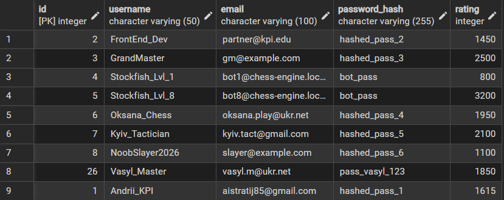
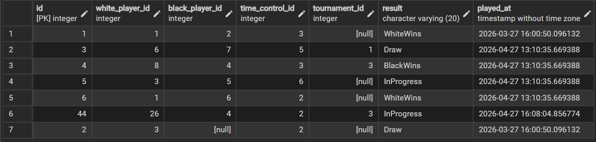
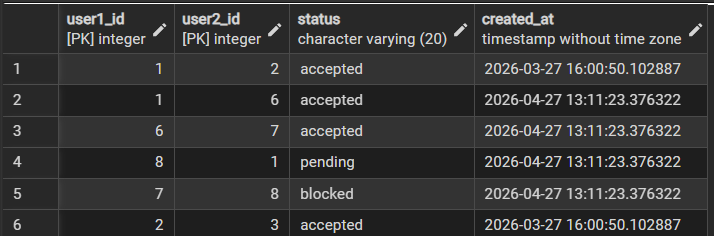

---
## DELETE - Видалення даних
```
-- Видаляємо всі відхилені запити в друзі, щоб очистити базу
DELETE FROM public.friendship 
WHERE status = 'blocked';

-- Видаляємо випадково створений турнір, який ще не розпочався і не має ігор
-- (Припустимо, ми створили тестовий турнір з назвою 'Test')
INSERT INTO public.tournament (title, start_date) VALUES ('Test Tournament', '2026-12-31 23:59:59'); -- створюємо для тесту видалення

DELETE FROM public.tournament 
WHERE title = 'Test Tournament';
```

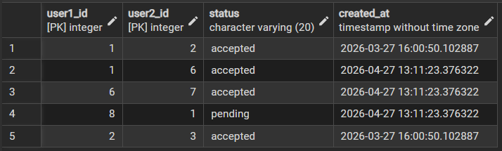
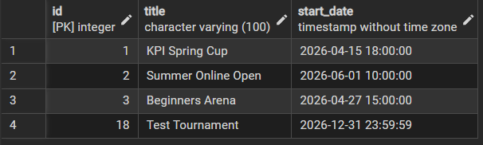
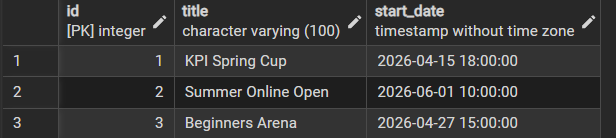

---
## Висновок
Виконання даної лабораторної роботи дозволило поглибити теоретичні знання та отримати практичний досвід використання інструментів DML у PostgreSQL. Реалізовані транзакційні запити наочно продемонстрували базові принципи функціонування OLTP-баз даних. Засвоєні методи маніпулювання даними складають основу для розробки високонавантажених систем, де пріоритетом є висока швидкість, точність та безперебійність обробки запитів від користувачів.