# Документація до Лабораторної №4 

### Зміст

1. [Короткий виклад вимог](###Короткий-виклад-вимог)
    
2. [Код відповідних OLAP запитів та Результати перевірки роботи запитів](##Код-відповідних-OLAP-запитів)
    
3. [Висновок до лабораторної роботи](##Висновок)

### Короткий-виклад-вимог
- Використовувати агрегатні функції, такі як `COUNT`, `SUM`, `AVG`, `MIN` та `MAX`, для обчислення зведеної статистики з ваших даних.
- Написати запити `GROUP BY` для групування рядків за одним або кількома стовпцями та обчислення агрегатів для кожної групи.
- Використовувати `HAVING` для фільтрації результатів згрупованих запитів на основі агрегованих умов.
- Виконувати операції `JOIN` (принаймні `INNER JOIN` та `LEFT JOIN`), щоб об'єднати дані з кількох таблиць.
- Створювати об'єднані запити на агрегацію для кількох таблиць, які об'єднують таблиці та створюють згрупований, агрегований вивід.
- Інтерпретувати результати ваших запитів та пояснити, що робить кожен з них.
### Код-відповідних-OLAP-запитів
#### 1. Агрегаційні функції

```sql
-- 1.1. Загальна кількість зареєстрованих гравців
SELECT COUNT(*) AS total_players FROM Player;

-- 1.2. Середній, максимальний та мінімальний рейтинг Elo серед гравців
SELECT 
    AVG(rating) AS average_rating, 
    MAX(rating) AS highest_rating, 
    MIN(rating) AS lowest_rating 
FROM Player;

-- 1.3. Кількість партій для кожного результату (скільки перемог білих, чорних тощо)
SELECT result, COUNT(*) AS games_count
FROM Game
GROUP BY result;

-- 1.4. Підрахунок кількості ходів для кожної партії 
SELECT game_id, COUNT(*) AS total_moves
FROM Move
GROUP BY game_id;
```
1.1 Загальна кількість зареєстрованих гравців (на цей момент)
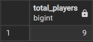
1.2 Середній, максимальний та мінімальний рейтинг Elo серед гравців
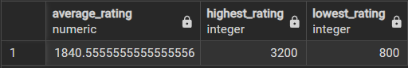
1.3 Кількість партій для кожного результату (скільки перемог білих, чорних тощо)
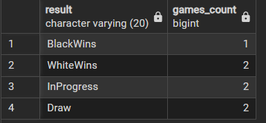
1.4 Підрахунок кількості ходів для кожної партії 
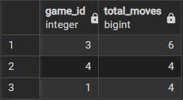
#### 2. Запити з JOIN
```sql
-- 2.1. INNER JOIN: Список ігор з іменами гравців та назвою часового контролю
SELECT g.id, p1.username AS white_player, p2.username AS black_player, tc.name AS mode
FROM Game g
JOIN Player p1 ON g.white_player_id = p1.id
JOIN Player p2 ON g.black_player_id = p2.id
JOIN Time_Control tc ON g.time_control_id = tc.id;

-- 2.2. LEFT JOIN: Список усіх гравців та назви турнірів, у яких вони брали участь
-- (включає гравців, які не брали участі в жодному турнірі)
SELECT p.username, t.title AS tournament_title
FROM Player p
LEFT JOIN Game g ON p.id = g.white_player_id OR p.id = g.black_player_id
LEFT JOIN Tournament t ON g.tournament_id = t.id;

-- 2.3. FULL JOIN: Поєднання гравців та їхніх друзів (для аналізу соціальних зв'язків)
-- Використовуємо FULL JOIN, щоб побачити всіх учасників таблиці Friendship
SELECT p1.username AS user_a, p2.username AS user_b, f.status
FROM Player p1
FULL JOIN Friendship f ON p1.id = f.user1_id
FULL JOIN Player p2 ON f.user2_id = p2.id;
```
2.1 Список ігор з іменами гравців та назвою часового контролю
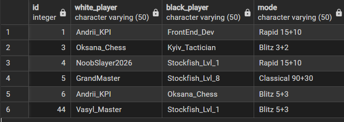
2.2 Список усіх гравців та назви турнірів, у яких вони брали участь
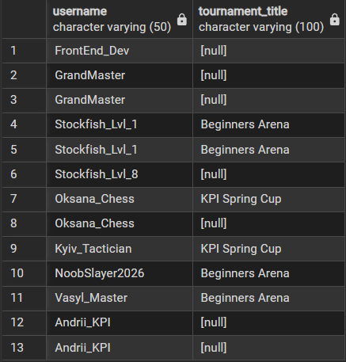
2.3 Поєднання гравців та їхніх друзів (для аналізу соціальних зв'язків)
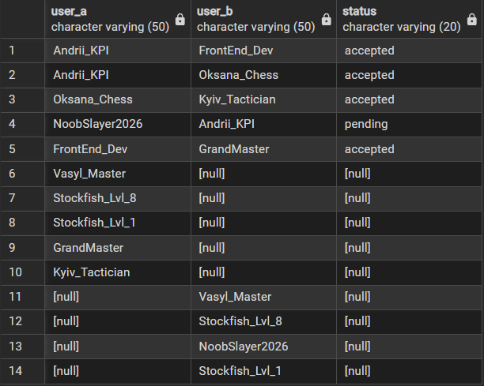
#### 3. Використання підзапитів
```sql
-- 3.1. Підзапит у WHERE: Знайти гравців, чий рейтинг вищий за середній по всій базі
SELECT username, rating
FROM Player
WHERE rating > (SELECT AVG(rating) FROM Player);

-- 3.2. Підзапит у SELECT: Вивести назву турніру та кількість ігор у ньому
SELECT t.title, 
       (SELECT COUNT(*) FROM Game g WHERE g.tournament_id = t.id) AS games_in_tournament
FROM Tournament t;

-- 3.3. Підзапит у HAVING: Знайти часові контролі (Time_Control), які використовувалися 
-- в іграх частіше, ніж у середньому будь-який інший режим
SELECT tc.name, COUNT(g.id) as usage_count
FROM Time_Control tc
JOIN Game g ON tc.id = g.time_control_id
GROUP BY tc.name
HAVING COUNT(g.id) > (
    SELECT COUNT(*) / COUNT(DISTINCT time_control_id) FROM Game
);
```
3.1 Підзапит у WHERE: Знайти гравців, чий рейтинг вищий за середній по всій базі
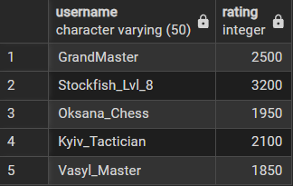
3.2 Підзапит у SELECT: Вивести назву турніру та кількість ігор у ньому
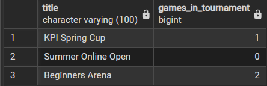
3.3 Підзапит у HAVING: Знайти часові контролі (Time_Control), які використовувалися в іграх частіше, ніж у середньому будь-який інший режим
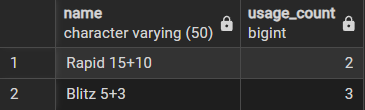

#### 4. Фільтрування груп (HAVING) та багатотаблична агрегація
```sql
-- 4.1. Знайти гравців, які зіграли більше 10 партій (Багатотаблична агрегація + HAVING)
SELECT p.username, COUNT(g.id) AS games_played
FROM Player p
JOIN Game g ON p.id = g.white_player_id OR p.id = g.black_player_id
GROUP BY p.username
HAVING COUNT(g.id) > 10;
```
4.1 Знайти гравців, які зіграли більше 10 партій (Багатотаблична агрегація + HAVING)
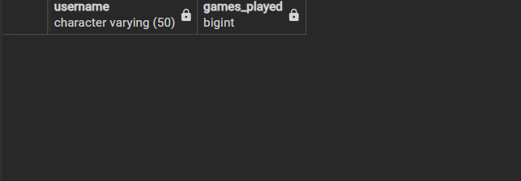
(поки нема гравця такою кількістю)

## Висновок
В ході лабораторної роботи, ми навчилися писати OLAP запити для аналізу даних в БД. Ми використовували агрегатні функції, такі як `COUNT`, `SUM`, `AVG`, `MIN` та `MAX`. Також робили підзапити з фільтрацією та запити з різними типами `JOIN` для виведенням аналітичних даних з різних таблиць в зручній формі для аналізу.